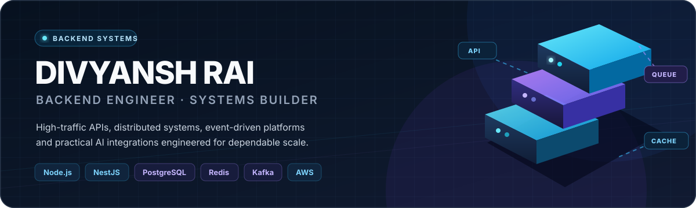
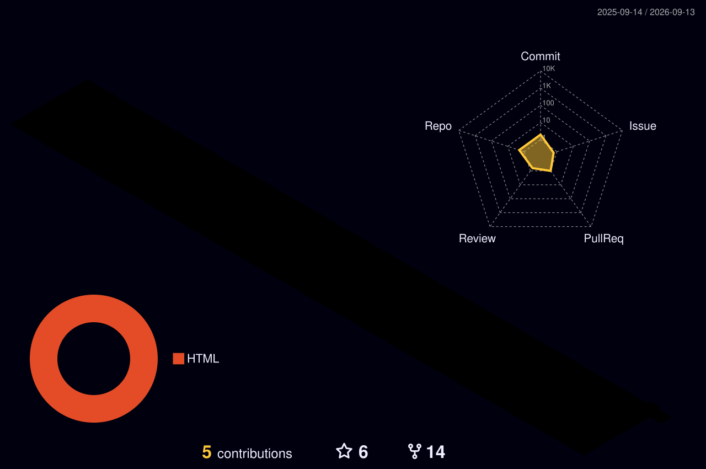

  

  
  
  

## 01 · About

I'm a backend engineer with **3.5+ years of experience** building production systems for commerce, customer engagement, and internal operations. I focus on systems that remain fast, reliable, and maintainable as traffic and product complexity grow.

- Built high-traffic APIs and multi-channel workflows serving **200+ merchants daily**
- Reduced latency by **70%** with caching and query optimization
- Improved onboarding efficiency by **60%** through indexing and process synchronization
- Built AI-powered operational tooling that reduced repetitive work by **40%**
- Open to **backend, product, and founding/early-engineer opportunities**

## 02 · Stack

  

| Area | Technologies |
| --- | --- |
| **Backend** | Node.js, NestJS, Express, GraphQL, REST APIs, Jest |
| **Data** | PostgreSQL, MongoDB, MySQL, TimescaleDB, ClickHouse, Redis |
| **Cloud** | AWS, Docker, Nginx, GitHub Actions, CI/CD |
| **Architecture** | Microservices, Kafka, event-driven systems, distributed systems, MCP |

## 03 · Selected systems

| System | What I built | Core technology |
| --- | --- | --- |
| **KwikEngage AI Ops** | MCP server connecting Claude with secure merchant operations APIs | Claude, MCP, Node.js, REST |
| **File Management Service** | Centralized media service with multi-resolution processing and CDN delivery | Node.js, S3, CloudFront, Redis |
| **Commerce data pipelines** | Shopify event stitching, analytics queries, and asynchronous processing | PostgreSQL, Kafka, GraphQL |

  <a href="https://divyanshrai.com/#works"><strong>Explore full case studies →</strong></a>

## 04 · Engineering focus

<pre>
performance      → indexing, query planning, caching, efficient APIs
reliability      → retries, idempotency, queues, failure isolation
scalability      → stateless services, event-driven flows, async processing
maintainability  → clear boundaries, observability, incremental modernization
AI integrations  → secure tools that improve real operational workflows
</pre>

## 05 · 3D contribution activity

  

The graph is generated daily inside this repository, avoiding the rate limits of public stats-card endpoints.

## 06 · Connect

I'm open to conversations about backend platforms, scalable APIs, distributed systems, practical AI integrations, and product engineering opportunities.

  <a href="https://divyanshrai.com"><strong>Portfolio</strong></a>
  &nbsp;·&nbsp;
  <a href="https://www.linkedin.com/in/divyansh-rai-6279b9188/"><strong>LinkedIn</strong></a>
  &nbsp;·&nbsp;
  <a href="mailto:divyanshrai27@gmail.com"><strong>Email</strong></a>

